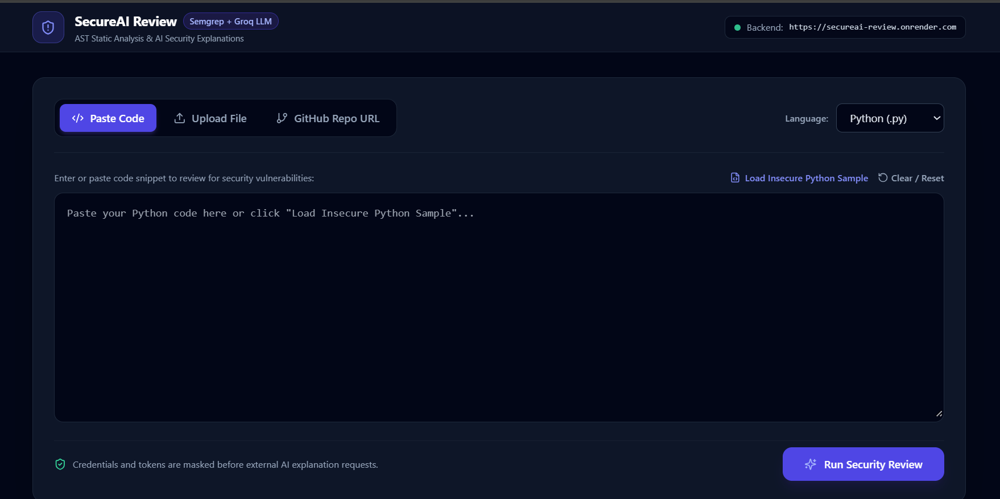
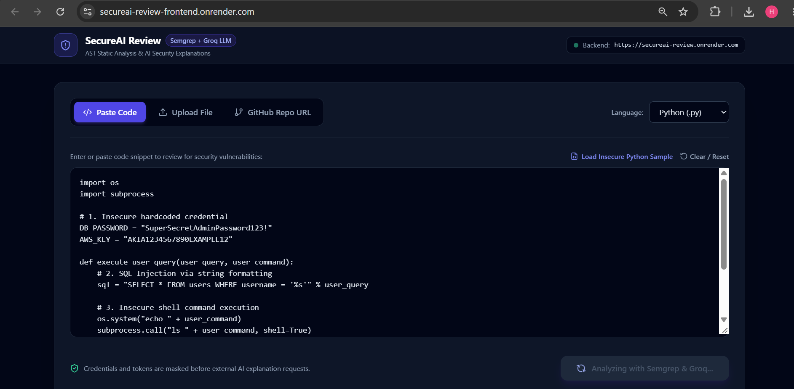
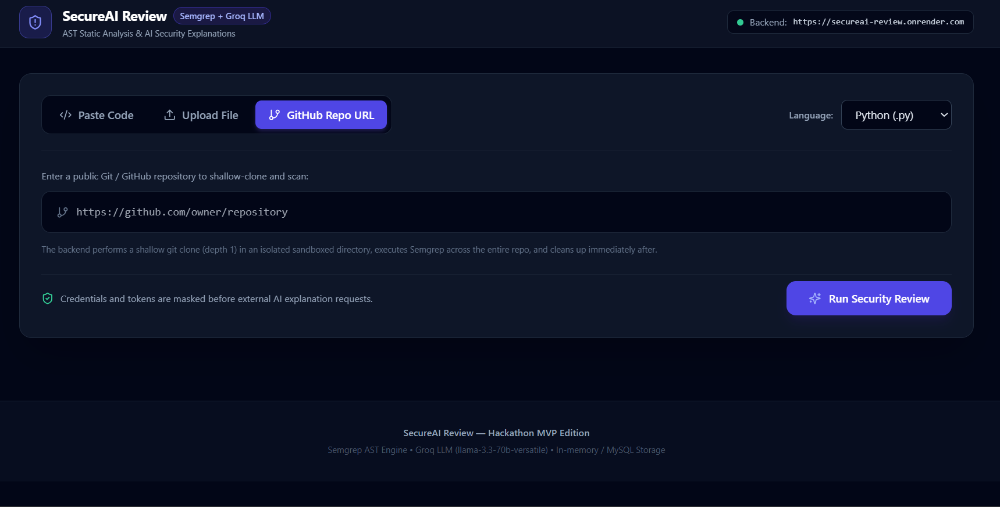
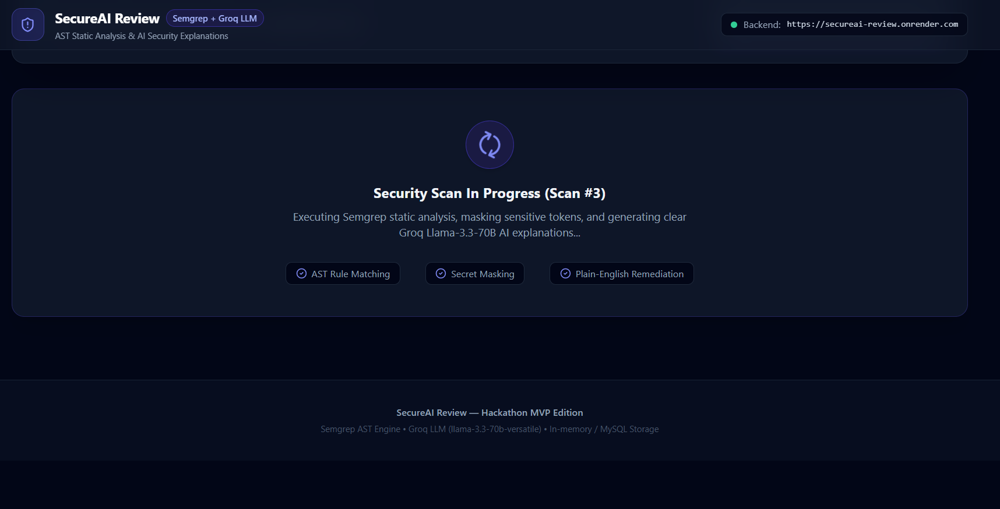
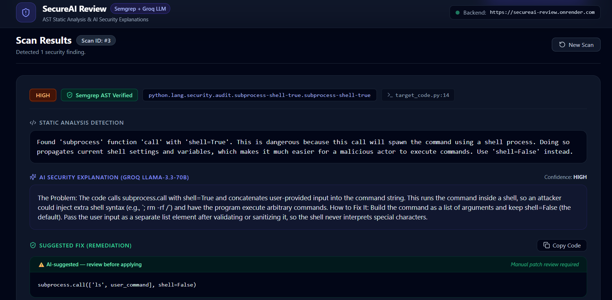

# 🛡️ SecureAI Review

**AI-powered secure code review — real static analysis explained in plain English.**

🔗 **Live Demo:** [secureai-review.onrender.com](https://secureai-review.onrender.com)
🔗 **API:** [secureai-review-backend.onrender.com](https://secureai-review.onrender.com)

Built for the CodeMyFYP Hackathon — Developer Productivity Track.

---

## 🎯 Problem Statement

Traditional Static Application Security Testing (SAST) tools generate opaque rule codes and complex security messages that developers often struggle to triage quickly. On the other hand, raw LLM-based code reviewers hallucinate vulnerabilities and lack formal AST (Abstract Syntax Tree) verification.

**SecureAI Review** bridges this gap:
1. **Deterministic Static Analysis**: Runs real **Semgrep** static analysis to detect verified code flaws (SQL injection, shell execution vulnerabilities, hardcoded credentials, insecure crypto).
2. **Secret Redaction**: Redacts API keys, credentials, and tokens from code *before* sending anything to external AI endpoints.
3. **AI Security Explanations**: Uses **Groq (Llama 3.3 70B)** to provide 2-3 plain-English sentences explaining the real-world security impact and concrete remediation code.
4. **Human-in-the-Loop Safeguard**: AI fixes are explicitly presented as suggestions for developer review — **no code changes are ever auto-applied**.
5. **Severity Cross-Check**: Compares static rule severity against LLM evaluation, flagging discrepancies (≥ 2 levels) with a visible conflict badge.

---

## Solution

SecureAI Review combines both: **Semgrep finds real vulnerabilities, an LLM explains and prioritizes them.** Static analysis determines what's real; AI determines what it means. Every AI-only finding is explicitly labeled as such — never presented with the same confidence as a verified finding.

SecureAI Review makes security review fast enough to actually happen. Semgrep finds what's real; an LLM explains what it means — turning a wall of cryptic rule IDs into plain-English answers a developer can act on in seconds, not a security course they need to take first.

Static analysis stays the source of truth. AI never gets to invent a vulnerability — it only gets to explain one, or clearly flag when it's making an educated guess beyond what the static engine could verify. The result: the trustworthiness of a real security tool, with the usability of asking a colleague "what's wrong with this code, and how do I fix it?"

---

## 📸 Screenshots

### Dashboard



### Code Input



### GitHub Repository Input



### Scanning



### Security Findings & AI Explanations



---

## Key Features

- **Three input methods** — paste code, upload a file, or scan a public GitHub repo
- **Real detection** — Semgrep across multiple rulesets (security-audit, OWASP Top 10, Node.js-specific), plus a custom rule for Express/Mongoose mass-assignment vulnerabilities
- **Secret redaction** — credentials are stripped before any code reaches the AI API
- **Plain-English explanations** — what's wrong, why it matters, how to fix it
- **Independent AI review** — when Semgrep finds nothing, the AI still reviews the code for logic-level issues, clearly labeled `AI-inferred` vs `AST-verified`
- **Severity cross-check** — flags disagreement between Semgrep's and the AI's severity rating instead of silently picking one
- **No auto-applied fixes** — every suggestion requires explicit human review

---

## Architecture

```text
                        USER
                         │
                         ▼
              ┌────────────────────┐
              │  Next.js Frontend  │
              │       Render       │
              └──────────┬─────────┘
                         │ POST /api/scan
                         ▼
              ┌────────────────────┐
              │  FastAPI Backend   │
              │       Render       │
              └──────────┬─────────┘
                         │
              ┌──────────┴──────────┐
              ▼                     ▼
        ┌───────────┐        ┌───────────┐
        │  Semgrep  │        │    Groq   │
        │   SAST    │        │  Llama AI │
        └─────┬─────┘        └─────┬─────┘
              │                     │
              └──────────┬──────────┘
                         ▼
                  Security Result
                         │
                         ▼
              ┌────────────────────┐
              │   Aiven MySQL      │
              │  (persistent, SSL) │
              └────────────────────┘
```

Backend and frontend are both deployed on Render; the database runs on Aiven's free managed MySQL tier over an SSL-required connection. If the database is ever unreachable, the backend degrades gracefully to an in-memory store rather than failing the request.

---

## Tech Stack

| Layer | Technology |
|---|---|
| Frontend | Next.js 14, React 18, TypeScript, Tailwind CSS |
| Backend | FastAPI (Python) |
| Static Analysis | Semgrep |
| AI | Groq API — Llama 3.3 70B |
| Database | MySQL (Aiven, managed, SSL), with automatic in-memory fallback |
| Hosting | Render (frontend + backend) |

---

## Setup

**Backend**
```bash
cd backend
python -m venv venv
.\venv\Scripts\Activate.ps1        # or: source venv/bin/activate
pip install -r requirements.txt
cp .env.example .env               # add GROQ_API_KEY and MySQL credentials
uvicorn app.main:app --reload --port 8000
```

**Frontend**
```bash
cd frontend
npm install
cp .env.local.example .env.local
npm run dev
```

**Verify**
```bash
cd backend
python app/semgrep_runner.py
python verify_e2e.py
```

---

## Security Design

- Secrets redacted before reaching any external API
- AI fixes are suggestions only, never auto-applied
- Findings labeled by source (`semgrep` vs `ai_only`) — never presented as equally certain
- Severity disagreements surfaced, not hidden
- Scan endpoint rate-limited
- Database connections enforced over SSL (Aiven managed MySQL)

---

**HARSHAVARDHINI N** — CodeMyFYP Hackathon, Developer Productivity Track

---